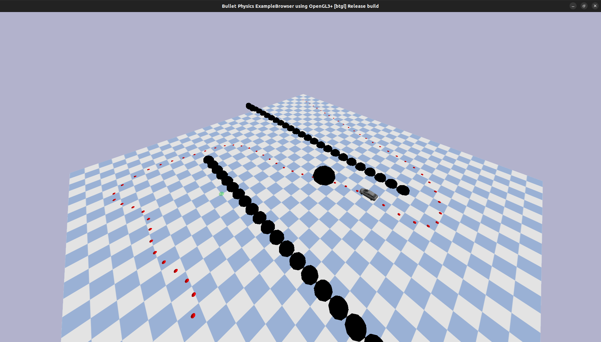

# Path planning and following in a dynamic environment with kinematic bicycle model constraints

This repository contains a framework for global and local path planning with static and dynamical obstacles.

**Authors:** Bas Bijsterbosch, Wimer Leijendekker, Tjeerd Wams, Jules Zwanen.

## File structure
├─ 📁 **environment** contains the descriptions of the three different environments and its obstacles.  
│   ├─ ```dynamic_obstacle.py```  
│   ├─ ```goal.py```  
│   ├─ ```three_environments.py```  
│   └─ ```wall_of_spheres.py```  
├─ 📁 **global_path_planner:** contains all global path planning algorithms  
│   ├─ ```cubic_spline_planner.py```  
│   ├─ ```dubins_path_planner.py```  
│   ├─ ```main_global_path_planner.py```  
│   ├─ ```RRT_dubins.py```  
│   ├─ ```rrt_star_dubins.py```  
│   ├─ ```rrt_star.py```  
│   └─ ```rrt.py```  
├─ 📁 **local_path_planner:** contains the code for the MPC.  
│   └─ ```mpc.py```  
├─ 📁 **utils** contains some utilization functions that perform (mathematical) operations.  
│   ├─ ```angle.py```  
│   └─ ```plot.py```  
└─ ```main.py:``` run the this file to run  the project.  

## Project description
This repository is made as a TU Delft project for the course Planning & Decision making. The goal of the project is first use Rapidly exploring Random Tree's with extensions for global path planning. The tracking of this path and avoiding dynamic obstacles is done using Model Predictive Control. This is done in three different environments to measure performance.

## Installation
These installation instruction assume that conda is installed on your computer, if not follow these instructions:
https://docs.conda.io/projects/conda/en/latest/user-guide/install/linux.html

1. clone this repository:
```console
git clone git@github.com:bbijsterbosch/pdm.git
```
2. Create and activate the environment from pdm/:
```console
cd /PATH/TO/REPOSITORY/pdm

conda env create -f environment.yml

conda activate URDF
```

## Running instructions
Run the main
```console
cd /PATH/TO/REPOSITORY/pdm
python3 main.py
```

### Run settings in ```main.py```
- bool ```animation```:     
Set to True for showing animation of the global path planner
- int ```env_id```:     
Set to 0, 1 or 2 for increasing difficulty of environment where 1 is easy, 2 is medium and 3 is difficult
- bool ```render```:     
Set to True for showing render of robot driving the environment
- bool ```dynamic_obstacle```:  
Set to True for implementing dynamic obstacle

> [!IMPORTANT]
> The local planner will start only when the user has closed the plots of the local planner.
